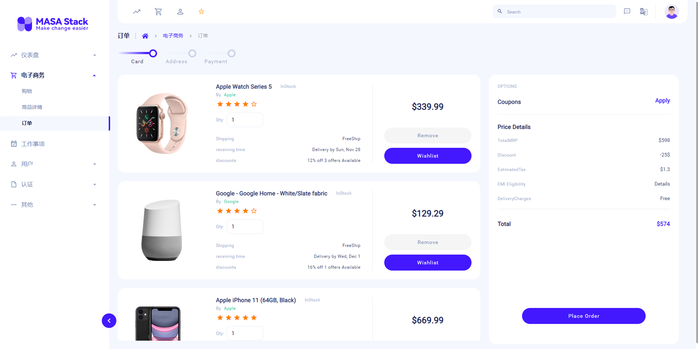
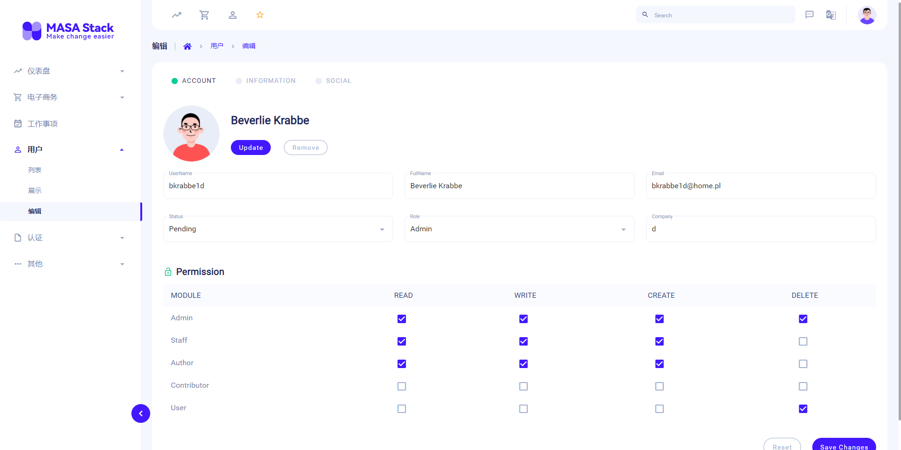
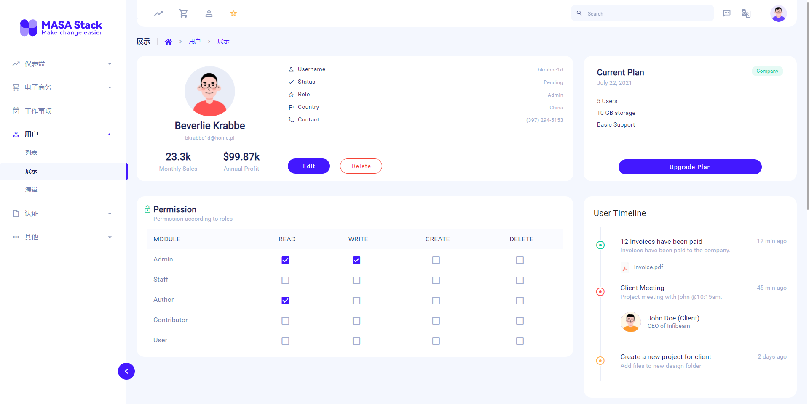
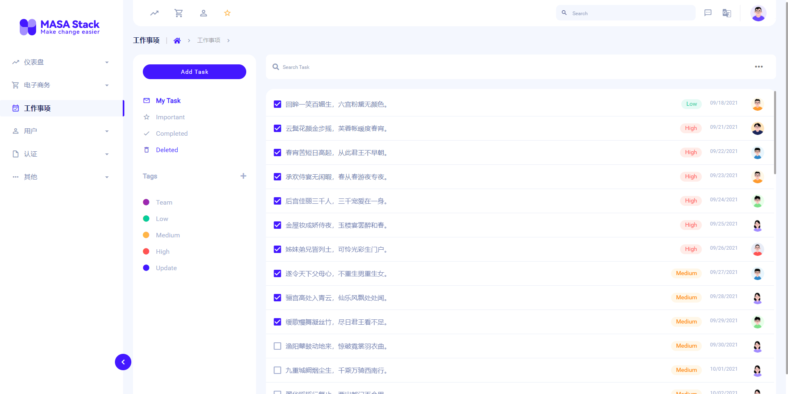

<p align="center">
  <a href="https://masa-blazor-docs-dev.lonsid.cn" target="_blank">
    
  </a>
</p>

<h1 align="center">Masa Blazor Pro</h1>

<div align="center">

Out-of-the-box mid-office front-end/design solutions, Blazor project templates, provide preset layouts for a variety of common scenarios.

[](https://github.com/BlazorComponent/Masa.Blazor.Pro/blob/develop/LICENSE) 

</div>

English| [简体中文](./README.zh-CN.md)

## Online example

[https://masa-blazor-pro.lonsid.cn](https://masa-blazor-pro.lonsid.cn "https://masa-blazor-pro.lonsid.cn")

## Templates

```
- Dashboard
  - eCommerce
- App
  - eCommerce
  - Todo
  - Invoice
  - User
- Page
  - Login
  - Register
  - Forgot Password
  - Reset Password
  - Account Seetings
  - 500
  - 401 
```

# Use

* [CLI](#CLI)
* [Existing Project](#Existing Project)


### CLI

**Install Template**

```shell
dotnet new --install Masa.Template
```

**Create Project**

* Blazor Server

```shell
dotnet new masabp -o Masa.Test
```

- Blazor WebAssembly

```shell
dotnet new masabp --mode Wasm -o Masa.TestWasm
```

- Blazor RCL

```shell
dotnet new masabp --mode ServerAndWasm -o Masa.TestRcl
```

**Go to the Server project directory**

```shell
cd Masa.Test
```

**Run**

```shell
dotnet run
```


### Existing Project

Introduce styles in `wwwroot/index.html`(WebAssembly) or `Pages/_Host.cshtml`(Server):

```html
<html lang="en">
	<head>
		<!--Style-->
		<link href="css/masa-blazor-pro.css" rel="stylesheet">
		<!--<link href="{ASSEMBLY NAME}.styles.css" rel="stylesheet">-->
		<link href="Masa.Blazor.Pro.styles.css" rel="stylesheet">
	</head>
</html>
```

> The `masa-blazor-pro.css` file is in the hierarchical directory of the project wwwroot/css/masa-blazor-pro.css 

> `Masa.Blazor.Pro.styles.css` needs to be changed to `{ASSEMBLY NAME}.styles.css`, the placeholder `{ASSEMBLY NAME}` is the assembly name of the project, see [ASP.NET Core Blazor for details CSS isolation](https://docs.microsoft.com/zh-cn/aspnet/core/blazor/components/css-isolation?view=aspnetcore-6.0)

- Setting up MasaBlazor theme

```c#
var builder = WebApplication.CreateBuilder(args);
builder.Services.AddMasaBlazor(builder => 
{
    builder.UseTheme(option=>
        {
            option.Primary = "#4318FF";
            option.Accent = "#4318FF";
        }
    );
});
```

## Rendering

|rendering|rendering|
| :-----------: | :-----------: |
|||
|||
|||

## Related projects

- [BlazorComponent（（Unstyled underlying component framework）)](https://github.com/BlazorComponent/BlazorComponent)
- [Masa Blazor（A set of standard basic component libraries based on Material design specifications and BlazorComponent interaction capabilities)](https://github.com/BlazorComponent/Masa.Blazor)

## Supported browsers


### Mobile devices


|         |  Chrome     |  Firefox     |  Safari     | Microsoft Edge |
| ------- | ---------   | ---------    | ------      | -------------- |
| iOS     | Supported   | Supported    | Supported   | Supported      |
| Android | Supported   | Supported    | N/A         | Supported      |

### Desktop devices


|         | Chrome    | Firefox   | Safari        | Opera     | Microsoft Edge | Internet Explorer |
| ------- | --------- | --------- | ------------- | --------- | -------------- | ----------------- |
| Mac     | Supported | Supported | Supported     | Supported | N/A            | N/A               |
| Linux   | Supported | Supported | N/A           | N/A       | N/A            | N/A               |
| Windows | Supported | Supported | Not supported | Supported | Supported      | Supported, IE11+  |

> Due to WebAssembly restriction, Blazor WebAssembly doesn't support IE browser, but Blazor Server supports IE 11† with additional polyfills. See official documentation

## How to contribute 

1. Clone
2. Create Feature_xxx branch
3. Commit with commit message, like `feat:add MButton`
4. Create Pull Request

## Contributors

Thanks to all the friends who have contributed to this project.

<a href="https://github.com/BlazorComponent/Masa.Blazor.Pro/graphs/contributors"> 
     
</a>

## Interactive 

QQ group | WX public account| WX Customer Service
:---:|:---:|:---:
 |  | 

## Development team

The Digital Flash technical team is an efficient, stable and innovative team. The team adheres to the original intention of enriching the Blazor ecosystem, and it is the pursuit of the Digital Flash technical team to continue to work hard to bring a better experience to the developers. Thank you for your support and use.

## Code of conduct 

This project adopts the code of conduct defined in the "Contributors Convention" to clarify the expected behavior of our community. For more information, see  [Masa Stack Community Code of Conduct](https://github.com/masastack/community/blob/main/CODE-OF-CONDUCT.md).

## License

[](https://github.com/BlazorComponent/Masa.Blazor.Pro/blob/develop/LICENSE) 

Copyright (c) 2021-present Masa.Blazor.Pro